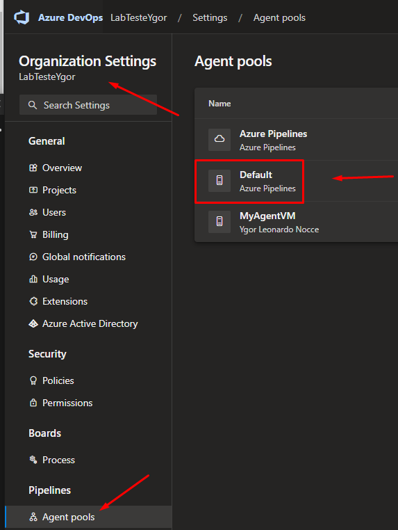

# Azure DevOps

- **O que é o Azure DevOps?**
    
    é um produto da Microsoft que fornece controle de versão, geração de relatórios, gerenciamento de requisitos, gerenciamento de projetos, compilações automatizadas, testes e recursos de gerenciamento de versões.
    
    No DevOps podemos automatizar:
    
    Builds, implatanções, verificação de qualidade de codigo, testes, monitoramento, lançamentos do sistema, configuração do sistema.
    
- **O que é DevOps?**
    
    Desenvolvimento e operações.
    
    DevOps é a cultura focada no Desenvolvimento e Operações e eliminação de processos manuais sempre que possível.
    
- **O que é DevOps PPT?**
    
    DevOps é PPT -> Pessoas, processos e tecnologia
    
- **O que é Cams?**
    
    CAMS - Cultura, automação, medição e compartilhamento (sharing).
    O pilares do DevOps é o CAMS.
    
- **DevOps Agil**
    
    Código e Build -> Desenvolvimento Agil
    Integração e teste -> CI - Integração continua
    Release e Deploy ->  CD - Entegra continua
    Operação -> DevOps
    
- **Azure Pipeline**
    - O que é Build?
        
        Build é o processo de construção do nosso software, uma compilação.
        
        - Compiladores
            
            Maven
            
            MSbuild
            
            NodeJs
            
            NPM
            
    - **Agents do Azure DevOps**
        
        agent build - é o nosso agent de compilação (nuvem ou onprimess)
        agent pool - é o conjunto de agent builds
        
        é uma ferramenta instalada em um servidor que sera responsavel pela execução de build e deploy.
        
        - Agentes Hosted
            
            (hospedados pela Microsoft) São Agents mantidos e gerenciados pela microsoft, com sua infra propria.
            Eles estão disponiveis no grupo de agentes, o Agent Pool Azure Pipelines.
            
            Após a execução da Pipeline, cria um nove agent e logo depois o agent é descartado.
            
        - Agentes Self Hosted
            
            (hospedados pelo próprio cliente em seus servidores): Os agentes Self Hosted são instalados no próprio ambiente do cliente.
            partir dai ficam disponíveis para a execução dos pipelines.
            
            Agentes que você configura e gerencia, hospedados em suas VMs	
            Exemplo: Azure DevOps Services, Azure DevOps Server, TFS (Team Foundation Server).
            
        - Instalando um Build Agent no Windows
            
            1 - Clique em **Organization Settings, Pipelines e Agent pools ( ira mostar todos seus agents )**
            
            2 - Selecione o um agent (nesse caso selecionamos o Default)
            
            
            
            3 - Depois Clique em New agent e Download 
            
            Nota: Nesse caso vamos baixar o do Windows (certifique-se seu sistema é x64 ou x86)
            
            
            
            4 - Abra o PowerShell e coloque os comandos abaixo:
            
            Nota: Coloque o comando Cd.. até chegar em PS C:\>
            
            ```powershell
            mkdir agent
            ```
            
            ```powershell
            Add-Type -AssemblyName System.IO.Compression.FileSystem ; [System.IO.Compression.ZipFile]::ExtractToDirectory("$HOME\Downloads\vsts-agent-win-x64-3.227.2.zip", "$PWD")
            ```
            
            ```powershell
            .\config.cmd
            ```
            
            5 - Após colocar os comandos, vai pedir o link do seu projeto no Azure DevOps, no meu caso: [https://dev.azure.com/LabTesteYgor/](https://dev.azure.com/LabTesteYgor/) e aperte Enter.
            
            6 - Agora ele vai pedir uma altenticação PAT e aperte Enter.
            
            
            
            7 - Vá para o Azure DevOps → User settings → Personal access tokens.
            
            
            
            8 - Clique em New token
            
            1. colque um nome para o nosso agent, nesse caso → Agent-Build.
            2. Selecione a organização 
            3. Coloque o tempo de Expiration do Build ( quanto tempo ele vai expirar ou não)
            4. Selecione o escopo do build, se é de Full Access ou customizado
            5. Clique em Criar
            
            
            
            9 - Após criar o Token e copiar, vá para o PowerShell e cole o token gerado:
            
            1. Aperte Enter para usar o nome padrão do agent e o local
            2. Nas proximas opção iremos colocar todos Y, para seguir com a criação do agent
            3. Pronto nosso agent está criado e autenticado.
            
            
            
        - Instalando um Build Agent no Linux como Serviço
            
            
    - Definição de build Azure DevOps
        
        Pode ser Feito por [YAML](https://www.notion.so/YAML-78f94a3493d24be0b11b1a91053425cc?pvs=21) ou editor Classico
        
    - Variaveis e Grupos de Variaveis
        
        Qual o Objetivo dessas variaveis de Build?
        
        - Obeter dados importantes em varias partes do nosso build Pipeline.
        - Somente leitura
        - Geradas automaticamente pelo Azure DevOps
        
        Criar variaveis nas pipelines do AD: $(valor da variavel) , exemplo: $(Build.DefinitionName)
        
    - Criando uma Pipeline [YAML](https://www.notion.so/YAML-78f94a3493d24be0b11b1a91053425cc?pvs=21)
        
        Primeiro acessamos o Azure DevOps.
        
        1 - Clique em Pipelines 
        
        2 - Clique em Create Pipeline.
        
        
        
        3 - Depois escolha como você deseja criar seu pipeline, yaml ou Editor Classico. Nesse caso vamos criar apartir do nosso repos criado no DevOps.
        
        
        
        4 - Agora selecione o repos aonde está seu código.
        
        
        
        5 - Após clicar no repos, ele mostra templates pra você criar sua Pipeline (de acordo com o codígo no repos)
        6 - Pode usar templates, criar um [YAML](https://www.notion.so/YAML-78f94a3493d24be0b11b1a91053425cc?pvs=21) do zero ou usar um [YAML](https://www.notion.so/YAML-78f94a3493d24be0b11b1a91053425cc?pvs=21) já existente. 
        
        7- E clicamos no template  **ASP.net**
        
        
        
        8 - Pronto, nossa Pipeline Yaml está criada.
        9 - clique em Save.
        
        
        
    - Criando uma Pipeline Classic Editor
        
        Primeiro acessamos o Azure DevOps.
        
        1 - Clique em Pipelines 
        
        2 - Clique em Create Pipeline.
        3 - Depois escolha como você deseja criar seu pipeline, yaml ou Editor Classico. Nesse caso vamos criar por editor Classico
        
        
        
        
        
        4 - Podemos selecionar varios repos, Azure Repos, GitHub e etc. Mas nosso código está no Azure Repos.
        
        - Agora temos que selecionar nosso projeto.
        - O repositorio que vamos utilizar.
        - E nossa branche com o código mais atual.
        
        5 - E clicamos em continue
        
        
        
        6 - Podemos criar um Empty Job (um job em branco, sem nada) ou usar um template
        7 - Nesse caso vamos usar um template, **ASP.NET**
        
        
        
        8 - E assim está criado nosso build Classic Editor
        
        - Temos nosso Agent Job
        - Nossas tasks
        - Nosso agent e s.o que vamos rodar
        
        9 - Clique em Save & Queue
        
        
        
        10 - Pipeline finalizada
        
        
        
    - Integração Continua e Entrega Continua ( C.I and C.D )
        
        A **integração contínua** é uma prática de desenvolvimento de software DevOps em que os desenvolvedores mesclam regularmente suas alterações de código em um repositório central, após o qual compilações e testes automatizados são executados .
        
        - Principais tarefas no C.I
            - Compilar
            - Qualidade do Código
            - Rodar Testes Unitarios
        
        A Entrega contínua é disponibilizar nossa aplicação em seus ambientes, em tempos curtos e com menor custo e sem perder qualidade e de maneira objetiva.
        
    - O que é Azure App Services?
        
        É um Serviço para hospedar aplicativos Web, APIs REST e Back end mobile.
        
    - Como criar uma Release (C.D)
        
        [Como criar uma Release e fazer Deploy em um App Service.](https://www.notion.so/Como-criar-uma-Release-e-fazer-Deploy-em-um-App-Service-cd57e244275e40c692e55fa2f8fb6315?pvs=21)
        
        [**Link no Github**](https://github.com/ynocce/Az-DevOps-Projeto-1)